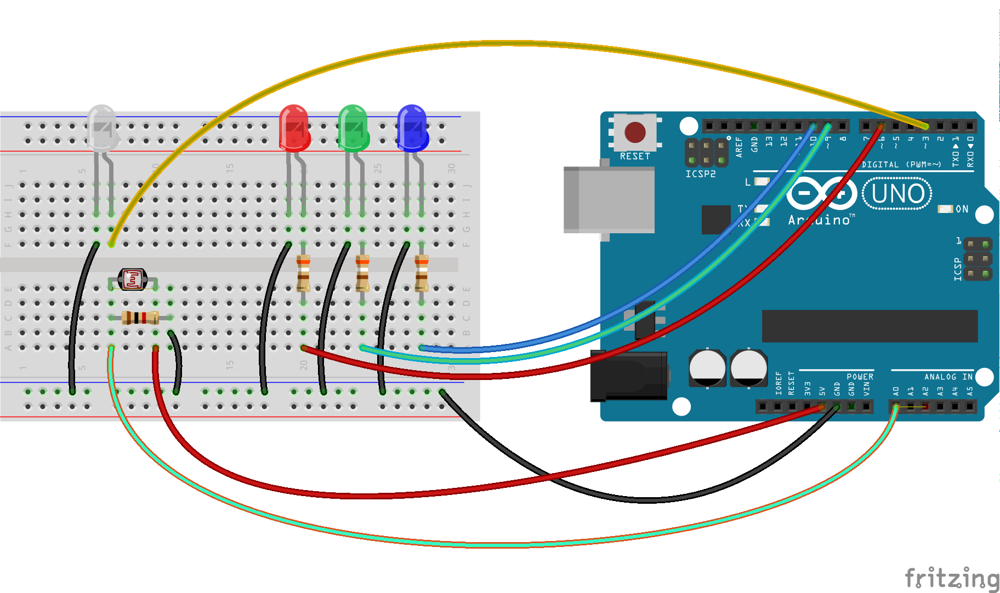

ambiance
========

Usage
-----
When the room is dark, the IR led turns on the led strip, the "mood lamp" is
activated, and the music starts.

For the "mood lamp", see this Instructable:
[Mood Lamp with Arduino](http://www.instructables.com/id/Mood-Lamp-with-Arduino/)

Schematics
----------
An Arduino Uno is connected to the USB port of a Raspberry Pi.

* IR led connected to pin 3 (PWM);
* light-dependent resistor (LDR) connected to pin A0 (analog);
* 3 leds (red, green, blue) connected to pins 6, 9, 10 (PWM).

Libraries
---------
* Arduino: [Arduino-IRremote](https://github.com/shirriff/Arduino-IRremote)
* Raspberry Pi: [pySerial](http://pyserial.sourceforge.net/)
